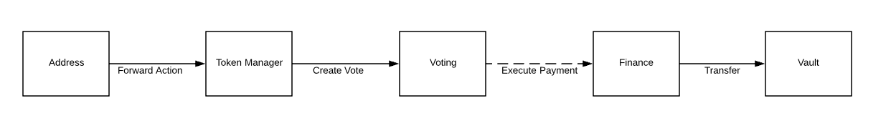
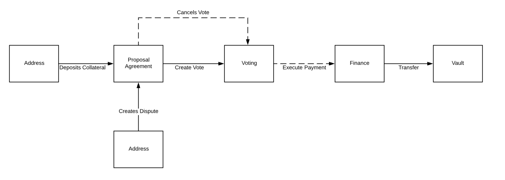
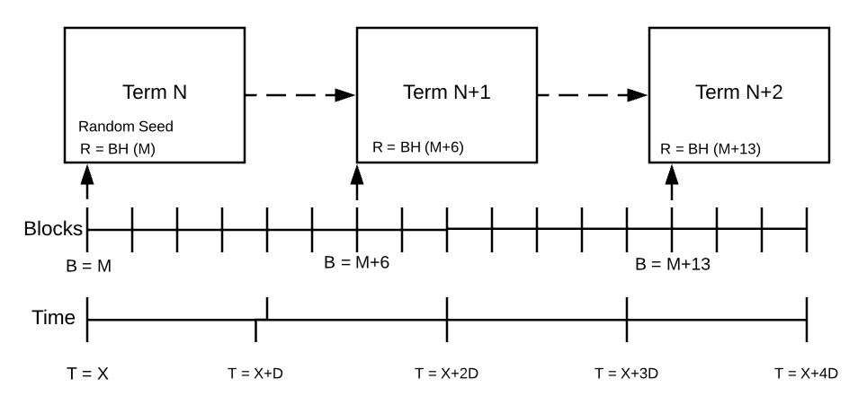
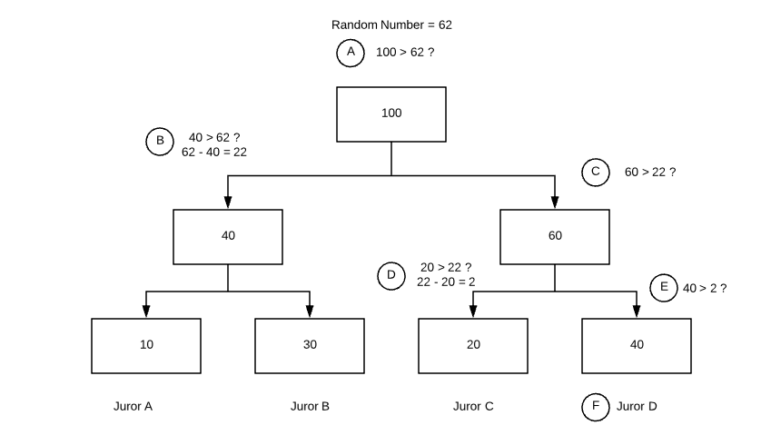

# Aragon Network

Aragon is a platform for creating and operating an organization on a blockchain network. Each Aragon organization exists as a set of smart contracts which define the organization's stakeholders and their associated rights and privileges. However, some rights and privileges are impossible to encode with smart contracts alone because smart contracts cannot directly encode subjective constraints. Voting is one way to impose a subjective constraint using a smart contract as it takes human inputs as a filter, however, voting assumes a majority of stakeholders will always honor the mutually understood intent of the organization. If we want organizations to be able to protect the interests of minority and passive participants we need more effective ways to enforce subjective constraints on an organization's actions.

The Aragon Network is an Aragon organization which provides infrastructure and services to users of the Aragon platform. The Network is governed by holders of its native token ANT.

The Aragon Court is a decentralized oracle protocol developed and maintained by the Aragon Network. The Aragon Court can be used by organizations, including the Aragon Network, to resolve subjective disputes with binary outcomes. When combined with the existing Aragon infrastructure, it enables any organization to create *proposal agreements* which define subjective constraints on an organization's operation that can be enforced even by a minority stakeholder. Jurors stake ANT in order to participate as dispute resolution service providers in exchange for fees provided by organizations which opt-in to use the service.

## Aragon's Permission Architecture

Organizations control which addresses have access to perform actions on behalf of the organization in a permission registry called the A*ccess Control List*. Addresses on the registry can be externally owned accounts or contracts. Some contracts are intended to *forward* actions based on pre-defined criteria, for example a voting app will forward action after the successful approval vote.

By chaining multiple permissions together we can define complex criteria which constrain how actions can be performed within the organization. To illustrate this we can look at common scenario where we want to allow treasury funds to be transferred, but only if they are 1) proposed by a member of the organization, 2) approved by a majority of members, 3) within a pre-determined budget. This can be accomplished by configuring a permission chain using multiple applications each imposing logical constraints on the final action as follows:

*Figure 1: Token Manager --> Voting --> Finance --> Vault*

The vault, which stores the organizations assets, grants the transfer role only to the finance application, which internally implements budgeting and recurring payment logic. The finance application's *Create Payments* role is assigned exclusively to the Voting application so that the only way to create payments is to successfully pass a vote. The voting application's  *Create Votes* role is granted exclusively to the Token Manager of the organization's native token. The Token Manager will forward actions from Token Holders the Token Manager's associated token.

This process effectively constrains how funds can be transferred in the organization, but the approval of a given transfer is ultimately left up to a majority vote, and its not unreasonable to be concerned that a majority of the organization's members might one day decide liquidate the organization, excluding minority stakeholders from the distribution of funds.

To avoid this organization's need a mechanism to impose a subjective constraint that can be enforced by the actions of any individual within the organization rather than a majority of participants.

### Proposal Agreements

Proposal Agreements are designed to facilitate these types of constraints within Aragon organizations. They allow an organization to define human readable terms and require proposers to deposit collateral before the users intent can be forwarded.

The human readable terms can be used to protect the interest of minority stakeholders as described in the previous section, but they can also be used to define basic quality standards for what supplemental information must be included with a proposal.

Proposal agreements can be paired with a Voting app by assigning the *create vote*, *pause vote*, and *cancel vote* roles.

*Figure 2: Proposal Agreement --> Voting --> Finance --> Vault*

With this flow, when a user wants to make a fund transfer they will be prompted to review and agree to the terms of the proposal agreement.

### Dispute Creation

If a user feels that a submitted proposal violated the proposal agreement terms they can choose to raise a dispute. When they raise a dispute they will need to deposit an equivalent amount of collateral, along with initial *dispute fees* determined by the court. They can also provide *evidence* to support their claim. The vote will be immediately paused until the dispute is resolved.

If the original proposer feels that the dispute is valid they can opt to do nothing and the dispute will be automatically ruled in favor of the disputer. The proposers collateral will be transferred to the disputer and the vote will be canceled. If the original proposer believes they will win the dispute then they must pay *dispute fees* and provide evidence to support their position.

Once both parties have submitted evidence and dispute fees, the case is scheduled to be reviewed by the *court*.

## Aragon Court Protocol

Proposal Agreement dispute resolution relies on a decentralized oracle protocol referred to as the *court* where *jurors* stake the Aragon Network's native asset ANT in order to earn the right to perform dispute resolution service and earn a portion of *dispute resolution fees*.

When a dispute occurs, a jury is formed by drafting jurors via *stake-weighted sortition*. Drafted jurors are required to commit to a ruling on the dispute within a commitment period, and then reveal their ruling after all drafted jurors have committed. The verdict is returned based on the majority decision of drafted jurors.

Before the verdict is enforced, there is an opportunity to *appeal*, which repeats the adjudication process with a larger set of jurors. Appeals can be made a fixed number of times before a *final judgement round* that requires every staked juror to commit to a ruling.

### Juror Staking

In order to participate as a juror, an individual must acquire ANT and then deposit it into the court's staking contract. Similar to a [token bonding curve](https://blog.relevant.community/bonding-curves-in-depth-intuition-parametrization-d3905a681e0a), the staking contract uses the current balance of deposited ANT to determine an exchange rate between ANT and the user's stake in the court. Unlike a token bonding curve, we do not treat the resulting economic stake as a transferrable token. This curved staking approach encourages jurors to participate early and establish the credibility of an instance of the court, and enables the network to potentially deploy multiple instances of the court protocol which compete with one another by specializing in resolving specific types of disputes.

The staking and un-staking actions are governed by the following formulas:

**Staking:**

$$s = t * ((1 + d / b)^r-1)$$

**Unstaking:**

$$c = b  * ((1+s / t)^{\frac{1}{r}}$$

Where `s` is the resulting stake in the court and `d` is the users deposit. When un-staking, `c` is the amount of ANT returned. The other variables represent state and parameters of the staking curve. `r` is the ratio of deposits to total stake, `b` is the balance of ANT in the staking contract, and `t` is the total amount of distributed stake.  

Once a prospective juror has staked they are considered *active* and eligible to be drafted to review cases. A distinction is made between a juror being *staked* and *active.* An *active* juror can *de-activate* themselves at any time, but they will not be able to *un-stake* until any pending disputes they have been involved in have completed.

### Juror Drafting

Juror drafting is managed via a process of *stake-weighted sortition*. In order to manage the sortition process efficiently, all of the court's operations are scheduled into *Terms. Terms* are defined in seconds and cannot be changed after the Court has been initialized. Terms are transitioned by calling a public *heartbeat* function which is used to make updates to *active juror stakes* from the preceding term and generate a new *random seed* for use during the subsequent term. A portion of the courts fees are used to compensate the caller of the heartbeat for gas usage.

*Figure 3: Court operations are broken into Terms*

For each dispute or appeal we have a number of available *juror slots* which must be filled. Each slot can be thought of as a seat on the jury. A single juror can occupy multiple seats, but each seat is associated with an equal portion of their stake which is committed and locked until the dispute is fully resolved.

One block after the heartbeat function is executed for the term in which a dispute is scheduled, a function to draft jurors for that dispute is called. This function can be called at any point during the term and the resulting selection of jurors will be the same. If this transaction does not happen before the term ends the dispute must be rescheduled for a subsequent court term.

To make the draft function efficient, active jurors are arranged into a tree structure based on their stake. Using the random seed for the term and the id of the dispute a random number is generated and used to traverse the tree and arrive at a juror. This process is repeated until all juror slots for the dispute have been filled.

*Figure 4: Traversing the sortition tree to select a juror*

Due to gas constraints, the draft function can select at most 100 juror slots per call, so to select additional jurors we can do selection in multiple batches across multiple transactions or we can adjust the amount of stake which is committed to a ruling per juror slot in order to increase the amount of stake that is drafted.

The sortition tree must be updated between terms as the proportional stake of jurors changes. Changes are queued and executed when the heartbeat function is called.

### Juror Ruling

Once jurors have been drafted the dispute enters a deliberation phase where jurors are expected to provide a ruling in favor of one party or the other. Jurors are expected to make an independent judgement, but we assume that out of band communication between jurors is possible. For particularly nuanced cases there may even be forums and discussion threads used to discuss the details of a dispute. However, to minimize the ability of jurors to simply copy the voting behavior of other jurors we require rulings to be submitted in a two-phase commit reveal process.

Jurors are given a certain number of terms, called the *commitment period*, to submit a hash of their ruling. After the commit period ends, jurors are given a certain number of terms to reveal their ruling, this period is called the *reveal period*. If a juror reveals their vote prior to the reveal period, anyone can use this information to penalize the juror in exchange for a reward. If a juror fails to commit and reveal a vote by the end of the *reveal period* they are penalized.

After the conclusion of *reveal period*, a majority of support among drafted jurors is used as a *preliminary ruling*. The preliminary ruling is considered final if there is no appeal made during the *appeal period*.  

### Appeals

Each dispute is subject to a maximum number of appeal rounds. The number of appeal rounds determines how the sortition tree and sub-trees must be structured and therefore cannot be adjusted on a per-dispute basis. Since each dispute and appeal round has a fixed duration, the max appeal rounds also determines the maximum amount of time before a final decision is reached.

Appeals can be triggered after a dispute has been resolved with a preliminary ruling in favor of one outcome or the other. In order for an Appeal to occur both sides of the dispute must deposit additional collateral. If neither side deposits the required collateral to trigger the next appeal round, the preliminary ruling is finalized. If only one side deposits the required collateral the ruling is immediately finalized in their favor. If both sides deposit the required collateral then the appeal round is scheduled.

The amount of required collateral depends on the appeal round and is a multiple of the fees required to compensate selected jurors. In higher appeal rounds where more juror stake is selected to adjudicate the dispute, the base amount of collateral required will be higher. The amount of collateral required will be a multiple of this amount, 2x the base amount for the side which is reinforcing the preliminary ruling, and 3x the base amount for side which is appealing the preliminary ruling. These deposit do not need to be supplied by a single party, but can be crowdsourced. When a final ruling is reached, the collateral of the loosing side will be used to compensate jurors and reward funders of the opposing side proportional to their contribution.

### Final Ruling

A final ruling is reached if a preliminary ruling is produced and neither side appeals, or if only one side appeals, or if the maximum number of appeals are reached. When a final ruling is produced the court needs to process collateral and stake redistribution.

**Redistributing and Unlocking Juror Stake**

After a final ruling has been decided, all the adjudication rounds in the dispute can be settled. Jurors that didn't vote for the final ruling will lose the tokens that they had at stake. All the aggregated penalties and the juror fees in a round will be distributed proportionally among the jurors that voted for the final ruling option.

In case that no juror in a round voted for the final ruling, the juror tokens will be burned and the collected juror fees for the round will be refunded to the creator of the dispute (in case that it was the first round) or to the appealing party that sided with the final ruling.

**Redistributing Collateral**

If there was any appeal rounds before the final ruling, the total amount of collateral that was deposited for triggering each round will be assigned to the appealer supporting the final ruling.

In the first adjudication round of a dispute (the original round created with the dispute), the Court doesn't directly manage collateral (as there may not be collateral at all or a different token is used). In case that there was collateral at stake depending on the Court ruling, whenever the Court has a final ruling it will notify the contract being *arbitered* with the ruling and this contract can then distribute collateral.

## Fee Summary

In order for the court to operate fees must be captured from users to compensate jurors for their effort, risk, and opportunity cost of capital. The market for dispute resolution services exhibits some dynamics of a predator-prey relationship. Disputes will be more rare if there is a common expectation that the dispute resolution process is reliable and fair. The result is that as disputes become more rare, or are settled in early dispute rounds, the incentive to participate as a juror decreases. As these incentives decrease there will be less stake in the court and the court may be perceived as less reliable, resulting in more disputes and more appeals leading to overall less consistent and efficient operation. To resolve this issue, fees are captured not just when disputes occur, but also on a recurring basis from users even when no disputes occur.

- **Agreement Tax**: A tax is imposed on organizations which choose to use the court as an arbitration provider. Taxes must be paid on a recurring basis for the agreement to remain valid. These fees are split between the Aragon Network's treasury and among all actively staked jurors.
- **Dispute Fee**: Dispute fees are captured at the time a dispute or appeal occurs. And are calculated based on a flat amount times the amount of juror stake selected in the dispute or appeal round. These fees are distributed only to drafted jurors who rule in favor of winning side.

This fee structure ensures that there is a consistent stream of revenue to support the operation of the court even if disputes occur irregularly. Fees are governed by the Aragon Network organization as described below.

## Governance

Governance authority over the court is granted to ANT holders by way of an Aragon organization.

Initially, all votes will last 1 Month, require 50% approval and 1% approval quorum. Creating votes requires depositing 1000 ANT into a *proposal agreement* with the following terms:

> Proposals must be made in good faith with the intention to improve the network's operational efficiency, quality, or breadth of service, and benefit all ANT holders in equal measure.

The organization will face many operational decisions, including but not limited to the following:

1. Changes to the organization's permissions or the content of the proposal agreement itself.
2. Changes to court fees and other configuration parameters.
3. Managing a treasury which is funded via a portion of the Court fees.
