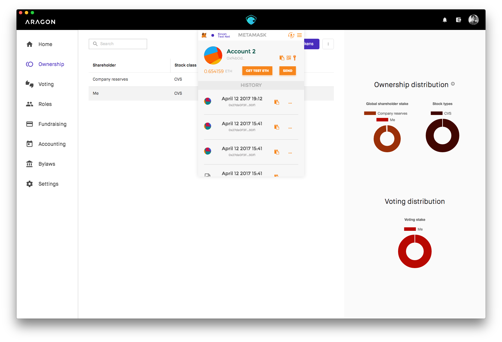
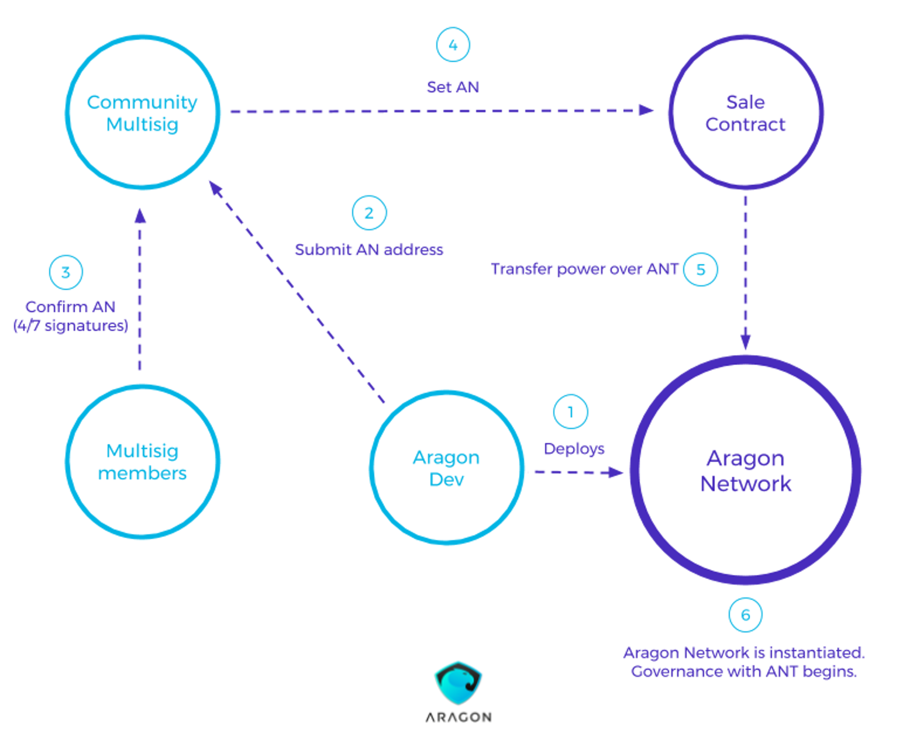
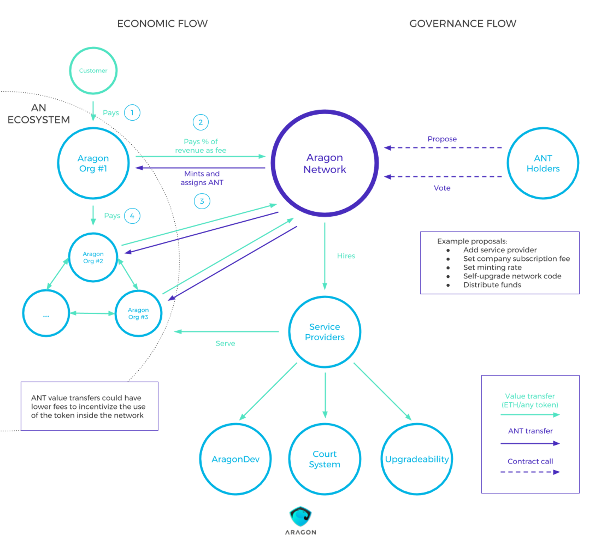
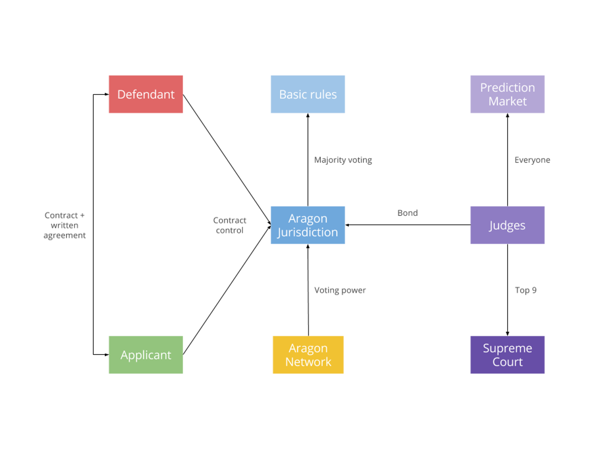
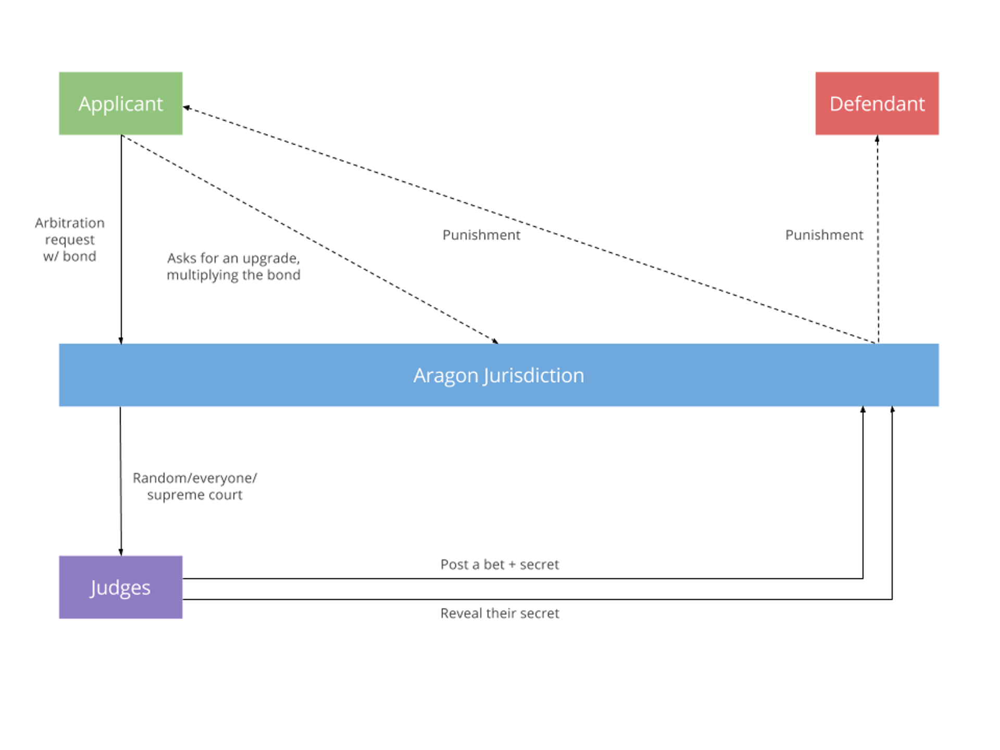
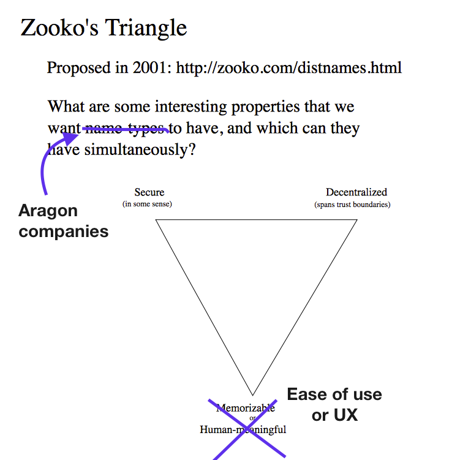

# **ARAGON NETWORK**  
**A DECENTRALIZED INFRASTRUCTURE FOR VALUE EXCHANGE**

Luis Cuende Jorge Izquierdo  
luis@aragon.one jorge@aragon.one


Version 1.1.1  
April 20th, 2017

## **Abstract**

The Aragon Network is a token-governed digital jurisdiction that focuses on creating the best conditions for true global indiscriminatory economic growth. Essentially, the Aragon Network is an ecosystem where organizations, entrepreneurs, and investors can efficiently and securely transact without risk of technical bugs or malicious parties.

Aragon Network organizations will be built using Aragon Core, a Solidity DAO frame-work and web-based decentralized app (dApp). Initially, Aragon Core will specialize in capitalist companies but is modular enough to accommodate other types of organizations.

This paper first discusses the principles of an organization and the functions of Aragon Core. Next, Aragon Network’s token model and network governance will be explained. Finally, it defines the two principal services the Aragon Network should implement to ensure its success; a _decentralized court solution_ and an _upgrade mechanism_. The _decentralized court solution_ will serve to arbitrate human conflict beyond what can be reasonably written in a smart contract. The _upgrade mechanism_ for Aragon Core organizations will facilitate useful upgrades needed to drive mainstream adoption by non-technical users.


The **Aragon Project** is built on the progress made by thousands of individuals over the last decades. However, we would like to highlight the work of some individuals that have been highly influential to Aragon:

1. **Ralph Merkle**, one of the inventors of public key cryptography, Merkle Trees [[1]](#references), and extensive research, including research on DAO Democracy which has influenced our thinking greatly.
2. **Satoshi Nakamoto**, creator of Bitcoin [[2]](#references).
3. **Vitalik Buterin**, creator of Ethereum [[3]](#references), inventor of the concept of DAO and author of multiple articles that have deeply influenced our vision.
4. The whole **Ethereum community** and developers, for the work on the web 3.0 and the fact that building dApps is a reality today.


Early-access to the present paper was given to a number of individuals from the Ethereum and the broader Blockchain community. Authors deeply thank and acknowledge the comments and criticisms that have made the design of the Aragon Network and this whitepaper as good as it is. Any faults that remain are, of course, the authors’.

In no particular order:
  
  - Simon de la Rouviere (Curation Markets and Societal Engineer, Consensys)  
  - Manuel Araoz (CTO, Zeppelin)  
  - Demian Brener (CEO, Zeppelin)  
  - Fred Ehrsam (Cofounder, Coinbase)  
  - Nick Grossman (GM, Union Square Ventures)  
  - Joel Monegro (Fat Protocols author and Union Square Ventures)  
  - Jake Brukhman (Founder, CoinFund)  
  - Ryan Zurrer (GP, Polychain Capital)  
  - Vincent Eli (CTO, Stabl)  
  - Daniele Levi (CEO, Stampery)  
  - Jean Amiouny (CEO, Shakepay)  
  - Roy Breidi (CTO, Shakepay)  
  - Brayton Williams (Partner, BoostVC)  
  - Herb Stephens (Democracy Earth)  
  - Santiago Siri (Democracy Earth)  
  - Joe Urgo (CEO, Sourcerers)  
  - Philipp Banhardt (Associate, Blueyard Capital)  
  - Nick Tomaino (Author, The Control)  
  - David Wachsman (Wachsman PR)  
  - Stefano Bernardi (Partner, Mission and Market)  
  - Zenel Batagelj (Cofound.it)  
  - Jan Isakovic (CEO, Cofound.it)  
  - Federico Ast (Crowdjury)  
  - Alex Maslar (Major edition and improvements to the whitepaper)  
  - Álvaro Rojas  
  - Alberto Elias  
  - Scott Stevenson  
  - Gregory Landua  
  - Kevin Chen  
  - Alex Felix  

## Table of contents

1. [Introduction](#1-introduction)  
  1.1. [About Aragon Core](#11-about-aragon-core)  
  1.2. [Current limitations](#12-current-limitations)  
2. [Aragon Core organizations](#2-aragon-core-organizations)  
  2.1. [Organization specs](#21-organization-specs)  
  2.2. [Implementation](#22-implementation)  
  2.3. [Modular software](#23-modular-software)  
  2.4. [Core summary](#24-aragon-core-summary)  
3. [DAO architecture: Kernel, Organs and Applications](#3-dao-architecture-kernel-organs-and-applications)  
  3.1. [The minimum definition of a DAO](#31-the-minimum-definition-of-a-dao)  
  3.2. [Principles of the DAO](#32-principles-of-the-dao)  
  3.3. [Kernel functions](#33-kernel-functions)  
  3.4. [Kernel basic components](#34-kernel-basic-components)  
4. [The Aragon Network](#4-the-aragon-network)  
5. [ANT, The Aragon Network Token](#5-the-aragon-network-token-ant)  
  5.1. [Network Kickoff and ANT Issuance](#51-network-kickoff-and-ant-issuance)  
  5.2. [A Continuos Token model](#52-a-continuous-token-model)  
  5.3. [Network Governance](#53-network-governance)  
  5.4. [Network Adapatability](#54-network-adaptability)  
  5.5. [Further uses of the token](#55-further-uses-of-the-token)  
  5.6. [Token technical features](#56-token-technical-features)  

[Appendix](#appendix-network-services)  
     A. [Decentralized arbitration system for the Aragon Network](#appendix-a-decentralized-arbitration-system-for-the-aragon-network)  
     B. [Aragon Network smart contract security and upgradeability strategy](#appendix-b-aragon-network-smart-contract-security-and-upgradeability-strategy)  

## 1. Introduction

### **1.1. About Aragon Core**
Aragon is a dApp that lets anyone create and manage any kind of organization (companies, open source projects, NGOs, foundations, hedge funds...) on the Ethereum blockchain.

Aragon implements basic features of an organization like a cap table, token transfers, voting, role assignments, fundraising, and accounting. The behavior of an Aragon organization is easily customized by changing the bylaws. In addition, Aragon organizations are extensible through third party modules that interact with the organizations' contracts.

### **1.2. Current limitations**
The properties of the Ethereum blockchain present unique opportunities for the creation and management of decentralized organizations, including immutability of records, transparency, and fast transactions. But in order to satisfy multiple requirements that human beings need in order to transact and create value, a layer on top of it needs to be created to align the incentives of everyone participating in the system.

When designing Aragon Core, multiple issues were addressed that would deter most people from creating, running, or interacting with a decentralized organization. These include:

  - **Subjective breaches**: Smart contracts can encode most of the possible breaches of contract, but there is always subjectivity in human relationships. A unbiased arbitration system is needed for cases where conflict is not explicitly resolved in the smart contract code.

  - **Software bugs**: The error is always between the chair and the keyboard. Code can contain bugs so the software needs to be easily upgradeable, and a sound bug bounty mechanism must exist to incentivize potential attackers to claim a bounty, rather than attack.

  - **Reward systems**: Monetization around certain protocols and systems is unclear at this point. Some players will be key to making organization possible, so a simple reward mechanism is needed.

## 2. Aragon Core organizations

### **2.1. Organization specs**
An organization has multiple needs, the main ones being:

- **Identity**: This is the very first pillar since we need to establish each entity's identity before operating with them.
- **Ownership**: Shares are a way to reward founders, investors, advisors, partners and employees and can determine the ownership and direction of the company.
- **Voting**: The company's shareholders should be able to have a word over its actions. We will directly link this to ownership.
- **Capital**: Since a venture can be risky and may need to acquire certain goods in order to operate or grow, capital in the form of investment/loans is needed.
- **People**: In the end, it's human beings who build the organizations. Easy ways to on-board them (identity) and reward them (payroll) are needed.
- **Outreach**: A company needs to target their audience in order for them to buy the company's product. In the Internet era, having a domain name is enough.
- **Payment processor**: Organizations need to be paid. There needs to exist a way for them to capture payments easily.
- **Accounting**: In order to manage expenses, burn rate and make business decisions, there is a need to maintain book-keeping.
- **Insurance**: A company is usually risky and may need to buy insurance in case something unexpected goes wrong.

Some of these create this dependency graph, which ends up being circular:

- Identity: No dependencies
    - Ownership: Depends on identity since you need to make sure you're interacting with the right entity
        - Voting: Depends on ownership since ownership implies control
            - Capital: Depends on voting since implies issuing shares
                - People: Depends on capital since you need it to hire people

### **2.2. Implementation**

**A. dApp runner**  
A major advantage of the Ethereum development framework is the multiple ways of running dApps. When considering the default dApp runner for Aragon, we considered the pros and cons of multiple options (see figure 2.1.3 A for considerations).

Figure 2.1.3 A: dApp runner comparison  

<table class="tg">
  <tr>
    <th class="tg-1lom">Runner</th>
    <th class="tg-1lom">Description</th>
    <th class="tg-1lom">Pros</th>
    <th class="tg-1lom">Cons</th>
  </tr>
  <tr>
    <td class="tg-yw4l">MetaMask</td>
    <td class="tg-yw4l">Google Chrome plugin that brings Ethereum capabilities to the Chrome browser - the user can confirm or deny all unsigned transactions</td>
    <td class="tg-yw4l">- Low friction - Easy to install and setup </td>
    <td class="tg-yw4l">- Still in beta  - Chrome only  - Not a full node, need to trust their  blockchain.</td>
  </tr>
  <tr>
    <td class="tg-yzt1">Mist</td>
    <td class="tg-yzt1">dApp browser that asks the user for permissions before interacting with the dApp</td>
    <td class="tg-yzt1">- Full Ethereum node. - 'Official' Ethereum dapp browser. - Hardware wallets compatible.</td>
    <td class="tg-yzt1">- Takes long to sync - High friction (more than 1 hour from in-  stall to using a dapp)</td>
  </tr>
  <tr>
    <td class="tg-yw4l">Parity</td>
    <td class="tg-yw4l">Full node with dApp browser with a Chrome extension</td>
    <td class="tg-yw4l">- Full Ethereum node. - Hardware walletscompatible</td>
    <td class="tg-yw4l">- High friction (around 1 hour from install to using a dapp)</td>
  </tr>
  <tr>
    <td class="tg-yzt1">Native Aragon app</td>
    <td class="tg-yzt1">Built with Electron, native app that runs natively on major desktop platforms.</td>
    <td class="tg-yzt1">- Control entire user experience: introduce new users toEthereum to use the app.</td>
    <td class="tg-yzt1">- Tons of reimplement- ed functionality. - Friction: Requires downloading an app.</td>
  </tr>
</table> 

Even though Aragon Core currently runs on all the above configurations as a pure dApp, we have ultimately implemented the native Aragon app with an Electron wrapper for its intuitive installation and familiar user interface, and injected MetaMask because it provides the greatest control of the user experience.

We will be pushing it as the default Aragon experience, and we think it will be friendly for people who have never heard of Ethereum to be introduced to it and be managing an Aragon Core organization in less than 15 minutes.

Figure 2.1.3 B: Native Aragon app [0.3 alpha release](https://github.com/AragonOne/aragon/releases).

**B. Identity**  
When issuing new tokens or paying an employee, the organization needs to know that the assets are sent to the correct person. To address this requirement, we’re initially integrating Keybase to assign identities to cryptographic entities. We are currently investigating other identity providers to integrate with Aragon, including uPort.  
We have published our thinking on managing identity in dApps in the Aragon blog [[4]](#references).

**C. Permissions**  
Identity drives us to permissions. Example of some permissions could be:

- Shareholder: Has the right to receive dividends, when emitted, and transfer the shares to another party if it doesn't go above a threshold set by the voting power.
- Executive: Has more permissions, can do some tasks without needing approval by voting.

However, decentralized trustless (or trust-reduced) organizations can allow for much more flexible relationships of different individuals with the organization. Aragon organizations have customizable bylaws that allow for fine-grain customization into who can perform an action (ie, an executive can add an employee to the payroll) or what needs to happen (ie, a voting needs to be approved to issue tokens) before the action is allowed.

**D. Reputation**  
Reputation is very valuable in free markets. We want every interaction to be rated if wanted.  
This enables organizations to value the work of a contractor, for example, and the contractor to value the company.  
Since we have all the relationship audit trail in place, we can easily trace the interactions in order for the reviews to really be authentic. This will be fully anonymous, if wanted.

**E. Onboarding**  
When opening the app, you should be able to create an Ethereum account and safely back it up.  
Afterwards, you should either:  
- Input the address of the company you want to interact with  
- Deploy a new company contract, in which case the dApp will automatically point itself to the contract's address

The onboarding process should feel familiar to anyone, not only to the cryptocurrencies enthusiasts. That's why it should be that easy.

**F. Ownership**  
Ownership in an Aragon Core organization is transparent and transferable. Each stakeholder’s holdings are public, and a stakeholder has the right to transfer ownership to another party. There are four transparent functions of ownership built into Aragon Core.  
These are:

  - List all stakeholders (and their holdings)
  - Issue shares, arbitrarily or with parameters
  - Sell or transfer tokens
  - Issue new tokens

The organization can issue tokens with limited transferability according to a Vesting Calendar or a different criteria.

It is important to note that all tokens issued will be compliant with the ERC20 token [[5]](#references) standard. This means that a stakeholders’  addresses can be linked to a name or tag, or fetched by a secure identity provider.

**G. Capital**  
Startup organizations need to be able to quickly raise capital. For a traditional startup, this would mean riding the VC unicorn rollercoaster, crowdfunding through a third party (e.g. Kickstarter), applying for a business loan, or bothering friends, relatives, and connections for investments. Aragon Core organizations can easily issue new shares in exchange for capital without operating with a third party, both through direct sales and public offerings.   
- Aragon Core organizations can issue shares directly to another party when the party sends the negotiated amount of currency.

- If an organization wants raise capital publicly, Aragon Core organizations can publish share offers in the marketplace. Investors can then directly contact to negotiate or invest in a hard limit number of shares.

**H. Rewards**  
Hiring and paying employees is unnecessarily complicated. Aragon Core simplifies the process. Aragon Core organizations will be able to put people on their payroll and issue them tokens under specific parameters, including time and/or task-based performance.

The user interface will let the user choose the amount to pay, the frequency, the shares to reward, and the parameters. To make the process more efficient, rewards can be in any Ethereum based token (using decentralized exchanges like the ones powered by the 0x protocol [[6]](#references)) or any cryptocurrency with solutions like Cosmos or Polkadot that enable inter-blockchain currency exchange.

If fiat is preferred, there will also be an option to generate prefilled credit cards with fiat from the company's funds. A solution like Shake, which has an API to generate instant and anonymous VISA cards, can be directly integrated with Aragon Core.

**I. Payment processor**  
For incoming payments, clients will be able to buy cryptocurrencies that then can be converted to the entrepreneurs' currency choice by using services like ShapeShift. After the user has acquired the cryptocurrency, the user will proceed to the payment. But for them, it will be a single step and everything will be transparently handled in the background.  
We foresee this as being the most common flow in the beginning, instead of users creating their wallets right away.

We will integrate with cryptocurrency exchanges and providers in order to provide a smooth user experience, similar to Stripe's.

**J. Accounting**  
Accounting is fully built in, and we will eventually provide connections to third party visualization services, in order not to reinvent the wheel.

### **2.3 Modular Software**
Aragon Core is all of the required pieces to run an organization with the minimum principles for an organization (see previous section for principle definitions) on the Ethereum network. However, organizations have unique needs that may not be available in the out-of-the-box Aragon Core software. To address this issue, we’ve built Aragon Core as a modular system that allows for additional functionality to be developed on top (see section 2.5 for technical details).

We also envision developers using Aragon Core as the foundation for use cases not related to creating and running an organization. Potential use cases for Aragon Core that we’ve envisioned include:

- Political election voting module - a small prediction marketplace could check if elected officials stick to campaign promises and reward those who voted for them
- Contractor payment module - Pay contractors as they work for your project or achieve milestones
- Accounting module - Accounting module with advanced data visualization (beyond offered in Aragon Core)

Importantly, all modules can be coded using standard web technologies. This lets the developer use the tool they like, while keeping strong sandboxing and security in place.

### **2.4. Aragon Core summary**
Aragon Core is where custom logic for organizational behavior lives. In summary, the main components of the Aragon Core application layer are:

  - bylaws that define user permissions, i.e. who can perform an action,  
  - a governance system to make decisions,  
  - a capital system for issuing and controlling tokens, and  
  - an accounting system to manage funds.

  Each of these components work together to meet the principles of an efficient and fair organization in a decentralized way. In addition, the modular nature of the system enables Aragon Core organizations to customize the software to meet their unique needs, or retrofit Aragon Core to fit another application (like voting for a political election). Aragon Core will implement a Module System so further functionality could be built on top.

## 3. DAO architecture: Kernel, Organs and Applications
The following sections discuss the minimum definition of a Decentralized Autonomous Organization (DAO) [[7]](#references), the principles of the DAO adopted by Aragon Core and the Aragon Network, and the structure and function of the DAO kernel.

### **3.1. The minimum definition of a DAO**
We believe a DAO should be defined at its minimum expression. This is defined as an organization that only possesses the capability to successfully update itself [[8]](#references), without losing its eternal identity.

### **3.2. Principles of the DAO**
Before defining the different components this kernel for the DAO has, let’s define what are the basic principles of the DAO that we want to accomplish.

  - **She is**. We need to recognize the eternal existance of the DAO as an entity that exists in the world.
    - A DAO will exist until herself decides to cease existing. At that point it will be gone forever.
    - A DAO is able to self-update her most basic components and continue being recognized as the same entity.
  - **She owns**. A DAO has internal capital and therefore owns property, principally in the form of digital assets (cryptocurrency, tokens, digital property such as domain names, IP…)
  - **She acts**. She can take action towards the outside world or towards herself. Her software executes computer code in the form of smart contracts.
  - **She is governed**. Besides its previously programmed actions, outside human or machine action will be able to trigger certain DAO actions.

### **3.3. Kernel Functions**
A core function of the kernel is to act as a registry that defines the organs and their respective priority levels. It’s important to note that each organ has a unique priority level. Thus, if a new organ is set to a priority level that already exists, it will replace the original organ.

The kernel is also responsible for accepting different types of entry point transactions and dispatching them to the organs using a standard API. The current entry-points supported by the kernel are:

  - **Standard transfers**, value transfer in ether: Vanilla Ethereum transactions that may have value attached to them.
  - **Pre-authorized transfers**, value transfer in ether: The kernel supports previously signed calls to the DAO by a certain sender. The sender can pre-sign a certain transaction payload and provide the signature (r, s, v values) to the party that will execute the transaction on their behalf. This could be another contract or part of the mechanism to implement state channels.
  - **Token transactions**, we consider tokens to be equally good value holding assets as ether, and we believe that at the application level they should be as powerful as ether. The kernel will accept token transfers (with data and therefore function execution) for all the standard methods. Implementations for the ERC23 [[9]](#references) token receiver interface and the approveAndCall workflow from ConsenSys HumanStandardToken [[10]](#references) are ready.

_Note that when the value transfer is in ether, the kernel will tokenize the ether in a standard token. This allows the DAO to interact with any tokenized asset while only implementing the sensitive logic once instead of implementing ether and tokens separately._

Finally, the kernel functions as a gatekeeper for new transaction requests. When the kernel receives a request, it asks the priority 1 organ whether the requested transaction is allowed by that entity. If allowed, the kernel redirects the transaction to the priority 1 organ (i.e. the dispatch organ). If not allowed, the transaction fails and terminates.

### **3.4 Kernel Basic Components**
**A. The dispatch organ – She acts I**  
The dispatch organ determines if the requested transaction is allowed to be performed by the requestor. It contains the logic or asks an oracle at an upper level of the stack for the logic. As discussed in the previous section, the kernel asks for permission before performing any transactions.

If the transaction is not permitted, the transaction fails. If permitted, the dispatch organ triages the request to the capable organ. It determines the organ to execute the transaction by checking each organ, including itself, in order of priority. The transaction will be executed by the first organ with the capability to execute the transaction.

**B. The meta organs – She is**  
The meta organ self-upgrades the DAO and controls self-destruction. It is responsible for updating both the root DAO reference to the kernel and the kernel organ registry.

**C. The vault organ – She owns**  
The vault organ secures the funds and properties that the DAO owns (token assets) and controls the ability to spend them.

**D. The token organ – She is governed**  
The token organ keeps track of DAO governance tokens. In addition, the token organ controls the logic for adding, replacing and removing tokens.

**E. The application organ – She acts II**  
The application layer for the DAO is an organ itself. Importantly, applications ran by this organ will have very little access to other organs for kernel and organ security (i.e. sandboxing).

Here in the application layer is where most of the logic for the organization will live. Different applications (in the form of Ethereum contracts) will be installed providing the DAO with extra functionality. We will create a module or application 'store' so organizations can easily install re-usable components in their organizations.

## 4. The Aragon Network

The Aragon Network (AN) will be the first decentralized autonomous organization whose goal is to act as a digital jurisdiction that makes it extremely easy and friendly for organizations, entrepreneurs and investors to operate.

The Aragon Network will be bootstrapped with a very thin Constitution voted by its governance. New laws can be added and they can be amended by the governance of the AN.

Also a very important role of the core Aragon Network contracts will be to ensure membership of organizations in the network and check that they are following the stablished rules.

The network will operate by accumulating capital in the form of fees to the operation of the organizations transacting on the network. These fees will contribute to the network internal capital, that the network governance will freely allocate. The main destination of these funds will probably be service providers to the network, that will be necessary for the network operations.

These main services are:  
- Development of the Aragon core contracts that allows running decentralized organizations.  
- A decentralized court (Appendix A), with the possibility of freezing organizations.  
- A contract upgradeability service for all Aragon Core contracts (Appendix B), with a built-in bug bounty mechanism.

We can say that the Aragon Network will provide everything an organization needs to thrive. Looking for a real-world metaphor, the best one would be what Delaware is today for companies, investors and entrepreneurs.

The Aragon Network is the far more efficient digital Delaware that lives in the blockchain.

## 5. The Aragon Network Token, ANT

The same way currency represents wealth in a macroeconomic way, ANT represents the wealth of the decentralized Aragon-enabled economy.

### **5.1. Network Kickoff and ANT Issuance**  
To kickstart the network, an uncapped number of ANT will be sold based on a predetermined price function that increases over time. The funds raised from the initial sale will be transferred to the Aragon Foundation to fund development of Aragon Core and the Aragon Network (Figure 5.1 B)

Some time after the sale ends, a Community members multisig will deploy the Aragon Network once they consider it implements its stated mission and it is secure to do so. At this moment the network will initiate and governance decisions will begin to be made by ANT token holders. (Figure 5.1 A)

**Figure 5.1 A: Aragon Network deployment mechanism** 
  

**Figure 5.1 B: The Aragon Token Sale mechanism**

### **5.2. A Continuous Token model**
ANT will continue to be minted by the network following the initial sale and network deployment. Minting new tokens will have a cost, and a percentage of the fees (decided by governance) paid by organizations to join the network will fund the minting of new tokens. This creates an incentive for Aragon organizations to pay fees, as organizations that contribute more will receive more ANT. This means that the organization will be more influential in network decisions.

The cost to mint new tokens will be determined by ANT token holders. This will likely be a contentious decision, and one where the basic economic principles of supply and demand need to be considered. For example, consider the scenario where the cost of minting tokens is too low. More and more tokens will be added to the supply, until supply greatly outweighs demand. This is a recipe for inflation and the value of individual ANT tokens will fall. Ultimately, we believe that token holders will eventually decide on a healthy equilibrium for inflation. By weighing the opinion of every stakeholder, the market will accurately reflect the optimal minting cost.

### **5.3 Network Governance**
Initially, the Aragon Network will be a liquid democracy [[11]](#references) (alternatives, such as futarchy [[12]](#references), are being considered and we are actively following the research in this area) that makes token issuing, fund allocation, and network rules decisions. See figure 5.3 for more details about a sample decisions made by ANT token holders.

This means that when the network is deployed governance decisions will be made by ANT holders with a system of proposal and votings. This mechanism will allow for creating proposals that result in the mechanism being upgraded.

Figure 5.3: Aragon Network governance decisions sample

<table class="tg">
  <tr>
    <th class="tg-rsd6">ANT issuance</th>
    <th class="tg-rsd6">Fund allocation</th>
    <th class="tg-rsd6">Network rules</th>
  </tr>
  <tr>
    <td class="tg-031e">Set <b>token minting cost</b>: Price for generating new ANT.</td>
    <td class="tg-031e">Allocate funds as a <b>one-time reward</b></td>
    <td class="tg-031e"><b>Append bylaws</b> to initial consti- tution</td>
  </tr>
  <tr>
    <td class="tg-bsv2">Set tax in <b>percentage for rev- enue</b> in any asset (ETH or to- ken)</td>
    <td class="tg-bsv2">Allocate funds as a repeating reward to a <b>service provider</b></td>
    <td class="tg-bsv2"><b>Remove bylaws</b></td>
  </tr>
  <tr>
    <td class="tg-031e">Set tax in <b>percentage for rev- enue</b> in ANT (Potentially lower to incentivize ANT use)</td>
    <td class="tg-031e">Allocate funds as a <b>global re- ward</b> to all token holders</td>
    <td class="tg-031e">Remove from network or freeze organizations that <b>don’t abide</b>.</td>
  </tr>
</table>

### **5.4. Network Adaptability**
The Aragon Network will provide a series of basic services that are needed to make decentralized organizations widespread. However, our intent is that it will remain as global and open as possible.

While the Aragon Network has some basic constitution and governance methods, everyone will be able to create another network inside the Aragon Network with a more specific set of laws. For example, you could create an organization, join the Aragon Network, and vote for a new set of laws specific to your organization. Effectively, organizations will be able to use the Aragon Network’s services basic constitution and services as a framework, and build a custom set of rules to govern relationships inside organizations.

### **5.5. Further uses of the token**
The ANT token will be the native token for all of the network services that require a token, either for governance or other functionalities. For example in the case of the court, holders will be able to use their tokens to help arbitration and get a rewarded.

### **5.6 Token technical features**
ANT will be ERC20 compatible with some extra features on top such as clone-ability and Vesting Calendars built-in.

## 6. Summary

The AN solves the core issues that may arise when running a fully decentralized organization, by providing services that work much better on a large scale and make Aragon organizations more efficient. It provides a way for the network to pay for its public goods.

Figure 6: The Aragon Network flow
  

## Appendix: Network Services

We have defined the two fundamental network services the AN will hire. These may or may not be developed by Aragon Dev.

The following are not protocol specs but a brief definition of our research on the matter and the features that the AN would need from them.

### **Appendix A: Decentralized arbitration system for the Aragon Network**
#### **1. Driving factors**  
When transacting in the market, trust breaches may emerge and cause disputes between stakeholders.

Thanks to the trustless nature of smart contracts, a lot of that problem surface disappears, since terms can be previously established and no part can trick them afterwards. But there are terms that are impossible to describe with code, and therefore disputes will emerge because of them.

Let's think about these two examples:

  - An investor invests into an organization and receives some voting power. The organization founder then goes rogue and sends all investment money to his personal account. If this was an Aragon organization, the investor just had to make sure that transactions above a certain threshold have to be approved by a majority voting.
  - A founder hires a new sysadmin in a SaaS organization. The employee then has access to their very valuable user database, and can steal it and use it for his own benefit. The code running on Ethereum doesn't really have any way to know what happened, therefore Aragon organizations are vulnerable to this human breach of trust.

We believe there should be an opt-in system for participants that want to cover themselves against these kinds of human behavior.

The traditional solution to this are government-powered jurisdictions. Since Aragon organizations are location and government-agnostic — they are meant to be run on the Ethereum network — we came out with a better solution.

#### **2. A decentralized, liquid, forkable jurisdiction**  
An Aragon Network Jurisdiction (ANJ) defines a set of contracts that:

  - Provide arbitration for any given dispute between two parties.
  - Allow ANT holders to vote on certain basic rules that the arbitrators will take in account.

#### **2.1. Entities**  
Entities (such as organizations or employees) can participate in the network by giving the entire control of their contracts to the ANJ contract.

Entities that interact between each other, for example an organization and an employee, will be able to state more details (than the ones already in the contract) of their desired relationship in any cryptographic way, for example timestamping a common document than is then signed by both parties.

#### **2.2. ANT functionality in the ANJ**

- Voting power for multiple decisions and purposes, such as a set of general basic rules and replacing judges in the Supreme Court.
- Ability to make bonds in order to open an arbitration.

#### **2.3. Judges**
Entities that want to be arbitrators can post a bond in order to participate as judges.

#### **3. Arbitration mechanism**

In order to open an arbitration, the applicant should post a bond. This bond will be given back if the case is resolved in their favor, and will be taken if not.

The arbitration petition can also be freezing, which means that it will immediately freeze the defendant's contracts (eg. in case an attacker is exploiting a bug). Only applicants that are among the defendant's organization shareholders will be allowed for this petition. (Figure A)

For human verdicts, the decisions of the judges are submitted using a two-step reveal of their decision for keeping it private for the whole decision making and not allowing the verdicts of other judges to influence their decision. This scheme is used in the auctions for Ethereum Name Service domain name registry. It works as follows:

- After deciding on the verdict, the judge will generate a secret random number and submit the hash and their decision to the court, while keeping the secret private.
- When the period for submitting verdicts is over, judges must reveal what their verdict was by providing their secret number. Then every one can check the validity of their verdict. Failure to reveal the secret results in a big penalization of the judge bond.
- For preventing judge collusion, if anyone provides the secret number of a verdict for a judge (proving that he made it public), the judge will be penalized and a part of the judge bond will go to the entity that reveal the secret.

#### **3.1. Human judges**
When an arbitration is started:

- A sample of 5 judges that posted a bond will be chosen randomly from the network. If one of them refuses to participate it is sightly penalized and another one is chosen.
- These judges look at the ANJ's basic rules, then organization-specific rules (if any) and then any other materials sent to them encrypted by the parties.
- They post a bet plus a secret.
- When the arbitration is due, they reveal their secrets.
- The bond is given back/rewarded to the judges, plus measures take place to penalize the losing party.
- The judges that voted the right answer are rewarded with a non-transferable token called reputation, and the others are extremely penalized.

#### **3.2. Prediction marketplace**
If the applicant is not satisfied with the human judges resolution, they can request an upgrade (by posting a significantly larger bond) to the next level, which is a prediction marketplace in which all the network judges can participate. For this, we can use projects like [Augur](https://augur.net/) or [Gnosis](https://gnosis.pm/).

When an arbitration is started:

  - These judges look at the ANJ basic rules, then organization-specific rules (if any) and then any other materials posted to the network.
  - They post a bet plus a secret.
  - When the arbitration is due, they reveal their secrets.
  - The bond is given back/rewarded to the judges, plus measures take place to penalize the losing party.
  - If the result is different that the one voted by the human judges in the previous step, all judges that voted the incorrect answer are extremely penalized.

#### **3.3. Supreme court**
If the applicant is not satisfied with the two previous steps, they can request an upgrade (by posting a significantly larger bond) to the ultimate level, which is a court composed of the top 9 judges by ANJ payout.

When an arbitration is started:

  - These judges look at the ANJ basic rules, then organization-specific rules (if any) and then any other materials posted to the network.
  - They post a bet plus a secret.
  - When the arbitration is due, they reveal their secrets.
  - The bond is given back/rewarded to the network, plus measures take place to penalize the losing party.
  - If the result is different that the one voted by the human judges in the previous step, all judges that voted the incorrect answer are extremely penalized.

These judges are paid a salary determined by the AN token holders and paid by the ANF. (Figure B)

#### **3.4. Incentives design**
Looking at the way the system is designed, one can argue that judges and the whole network if asked will be economically incentivized to dismiss the applicants request for arbitration and take her bond money to be split among them.

This makes the applicant know that chances are, if her case is not clear enough it will be dismissed. But the judges also know, that if they lie and dismiss cases just for their personal gain and the case is unanimously over ruled, their tokens/bonds will be burnt.

The system is designed to incentivize as less arbitration as possible and more as a safeguard for honest parties in case they are taken advantage of.

#### **4. Summary**
An ANJ provides the tools needed to solve all the subjectability humans relationships bring to the table.

It sets the incentives right for Aragon organizations to be a part of it, since:

  - Parties that want to interact with the given organization will want certain guarantees in case there's a breach of trust not covered by the contracts.
  - Some bugs could be stopped by opening an arbitration that could freeze all activity until the case is resolved.

ANJ's voting processes are fully liquid, but in any case between some stakeholders and the rest, it could potentially be forked. This creates incentives for their governance model to work. However, we believe an ANJ creates notable network effects because:

  - Interacting with other party will likely require them to be signed up too, since otherwise it opens a surface for breaches of trust.
  - If it's extended, then all parties (including investors) are familiar with its basic rules.

Figure A: An arbitration flow


Figure B: ANJ incentives

### Appendix B: Aragon Network smart contract security and upgradeability strategy

The great thing and at the same time problem with smart contracts is that once you create them, they will exist in the blockchain and execute whatever code the developer wrote, which not always reproduces the exact intention of the creator of the contract.

The most important example of this is The DAO hack, where an unexpected combination of actions, resulted in the contract sending tons of its money to the hacker. In this case, a Hard Fork was done at the protocol level to prevent the leak of funds.

At Aragon we are creating the software needed to create and run DAOs, but in a scalable and easy way so people that have never heard of Ethereum can run their organizations using it.  
We need to build a system where people unfamiliar with the matter will be able to run their organizations with the certainty that they will always be running the latest version of the software and that they are as secure as possible from attacks.

This service will be available to all the participant organizations in the Aragon Network, but organizations can decide to what degree they rely on it, from total upgrade control (no code is modified in my organization if I don't approve it) to no control at all (keep me safe, I don't want to know anything), to a middle ground (don't normally upgrade me, but if there is a severe security threat do it automatically).

This is still a work in progress, but it is an important addition to the network if we want to see thousands of secure DAOs emerge.

#### **1. Components**

Described below are different components we currently have planned for ensuring the integrity of the network and individual organizations.

#### **1.1. Proxy libraries for upgradeable smart contracts**

The current way of deploying (serious) smart contract systems usually relies on performing a sound security audit of the contract, uploading it to the network and hope for the best. Since code is immutable law by default, it's not possible to roll out upgrades that may fix bugs or better map the programmer's original intention.

Or maybe it is not a fault of the programmer of the smart contract, the consensus algorithm of the protocol is changed and the contract becomes vulnerable to a new attack vector.

This is a problem when a system is not upgradeable and we think that the contract that was written today will be good forever. This might be true for simple systems, but not for DAOs or Networks as complex as Aragon.

We have been doing research to solve this problem for months and our current solution is to try to encapsulate as much as the system business logic in Solidity libraries. Doing Library Driven Development [[J. Izquierdo, 2017]](https://blog.aragon.one/library-driven-development-in-solidity-2bebcaf88736) and then instead of linking this business logic forever in the contract, having Proxy Dispatcher [[M. Araoz, 2017]](https://medium.com/zeppelin-blog/proxy-libraries-in-solidity-79fbe4b970fd) contracts that will know what version of the library each organization is linked with. We are working with the best smart contract security firm Zeppelin to create this system of proxies that dispatches to the upgraded versions of libraries and we recently published about it.

These techniques will allow for very thin organization contracts that just have storage and then redirect all the logic to these libraries that all organization uses.

In the case of a bug is found, the new version of the library is deployed and every organization in the network is upgraded depending on their settings:

  - Automatic upgrade.
  - Notification to upgrade, but requires approval.
  - Nothing at all, organization decides not to use upgradeability and handle it themselves.

#### **1.2. Network wide bug bounties**
The side effect of having the same contract run by multiple organizations is that it becomes a target for hacking. On a more positive note, there are also stakeholders incentivized to allocate resources to ensure this hacking doesn't happen.

The network will create a bug bounty program for all the contracts organizations rely on and the network contracts. History shows that when people are economically incentivized to do good, most people finding a bug will report it to the program and get the bounty, rather than looking for ways to harm more people.

We are experiencing with the idea of making the bug bounty pretty automatic, by having a test suite for organization contracts on chain, and if someone is capable of breaking the tests, automatically pay them out depending on the severity.

The upgradeabilty mechanism of the network fits very well with the bug bounty program, because the moment a vulnerability is found, the time that passes until it is solved for everyone in the upgrade track is minimized.

#### **1.3. Global safe stop**
In case a severe bug or attack is detected, the Aragon Network will be able to stop all organization contracts (every organization that opted in for this) and perform an investigation and code upgrade before restoring the service.

We will be developing a bot that will look at all public transactions coming to Aragon organizations and in case it detects weird behavior or unexpected state that might be a threat, it will page in someone from the Aragon Project. In case the bot determines the threat is big enough and action must be immediate, it could stop all organizations while the person in charge looks at the situation.

This means that in less than 30 seconds an attack could be stopped for all organizations, and fixed immediately with the upgrade mechanism. In case of a false positive, the person paged in would restart activity for every one and the downtime shouldn't be greater than 10 minutes.

#### **1.4. ANJ action against bad actors in an organization**
As defined in the Aragon Network Jurisdiction document, all organizations in the network agree to be bound to the ANJ decentralized court. This protects individual organization stakeholders from the pure objectivity of smart contracts, that makes it very difficult and unproductive to encode certain things.

Once a case is created, the court will be able to change or undo actions in the organization contract. This is only a protective measure for stakeholders. By placing a big enough bond, a shareholder of an organization can submit a case to the ANJ and as a preventive measure freeze the organization. If the court decides the case wasn't legit, this person would lose their bond to the court (and part to the organization).

#### **2. Tradeoffs**
As with most good things in life, security comes with tradeoffs.  
We can imagine a triangle very similar to Zooko's Triangle (Figure A) applied to building decentralized apps, with Security, Decentralization and Ease of Use at its edges. Prioritizing a lot on one, will certainly come at the expense of the other too.

Figure A: Zooko's Triangle

We find all three very important, but it is very difficult to have a perfect system on the three fronts. Our vision with this is to create a system where every user or organization can choose what compromises they are comfortable making.

**A. Security**  
By security we mean the capacity to solve to bugs or threats in a timely manner.  
**B. Decentralization**  
The problem with the upgrade mechanism is that at the end a trusted party is the one in charge of performing the software upgrades, which is a very centralizing factor. The Network may choose to add a voting scheme, in order for the upgrades to roll out only if they have been correctly peer reviewed.  
That's why our upgrading mechanism is opt-in, there will be people who will decide not to have so much security and be the ones that accept a software update for their organization.  
**C. Ease of use**  
The case in which you optimize security and decentralization, it certainly undermines ease of use as someone needs to understand the code of Aragon to upgrade the organization, which is a huge barrier.

#### **3. Summary**
With the methods outlined in this document, the Aragon Network can ensure:

- Future bug fixes and enhancements can be added to the contracts.
- Critical vulnerabilities' impact can be minimized thanks to the bug bounty program, the global safe stop and the ANJ actions.

## References
[1] Ralph C. Merkle, 1988: "A digital signature based on a conventional encryption function" [https://people.eecs.berkeley.edu/~raluca/cs261-f15/readings/merkle.pdf](https://people.eecs.berkeley.edu/~raluca/cs261-f15/readings/merkle.pdf)  
[2] S. Nakamoto, 2009: "Bitcoin: A Peer-to-Peer Electronic Cash System" [https://bitcoin.org/bitcoin.pdf](https://bitcoin.org/bitcoin.pdf)  
[3] V. Buterin, 2013: "Ethereum: A Next-Generation Smart Contract and Decentralized Application Platform" [https://github.com/ethereum/wiki/wiki/White-Paper](https://github.com/ethereum/wiki/wiki/White-Paper)  
[4] J. Izquierdo, 2017: "How Aragon approaches identity and the Ethereum Keybase Resolver" [https://blog.aragon.one/how-aragon-approaches-identity-and-the-ethereum-key-base-resolver-d548133e4a26](https://blog.aragon.one/how-aragon-approaches-identity-and-the-ethereum-key-base-resolver-d548133e4a26)  
[5] F. Vogelsteller, 2015: "ERC 20 token standard" [https://github.com/ethereum/EIPs/issues/20](https://github.com/ethereum/EIPs/issues/20)  
[6] W. Warren, A. Bandeali, 2017: "0x: An open protocol for decentralized exchange on the Ethereum blockchain" [https://www.0xproject.com/pdfs/0x_white_paper.pdf](https://www.0xproject.com/pdfs/0x_white_paper.pdf)  
[7] V. Buterin, 2014: "DAOs, DACs, DAs and More: An Incomplete Terminology Guide" [https://blog.ethereum.org/2014/05/06/daos-dacs-das-and-more-an-incomplete-terminology-guide/](https://blog.ethereum.org/2014/05/06/daos-dacs-das-and-more-an-incomplete-terminology-guide/)  
[8] Ralph C. Merkle, 2016: "DAOs, Democracy and Governance". Cryonics Magazine, July- August, Vol 37:4, pp 28-40; Alcor. [http://merkle.com/papers/DAOdemocracyDraft.pdf](http://merkle.com/papers/DAOdemocracyDraft.pdf)  
[9] Dexaran, 2017: "ERC23 token standard" [https://github.com/ethereum/EIPs/issues/223](https://github.com/ethereum/EIPs/issues/223)  
[10] Consensys, 2015: "HumanStandardToken" [https://github.com/ConsenSys/Tokens/blob/master/contracts/HumanStandardToken.sol](https://github.com/ConsenSys/Tokens/blob/master/contracts/HumanStandardToken.sol)  
[11] Liquid Democracy: [https://en.wikipedia.org/wiki/Delegative_democracy](https://en.wikipedia.org/wiki/Delegative_democracy)  
[12] R. Hanson, 2000: "Futarchy: Vote Values, But Bet Beliefs" [http://hanson.gmu.edu/futarchy.html](http://hanson.gmu.edu/futarchy.html)
